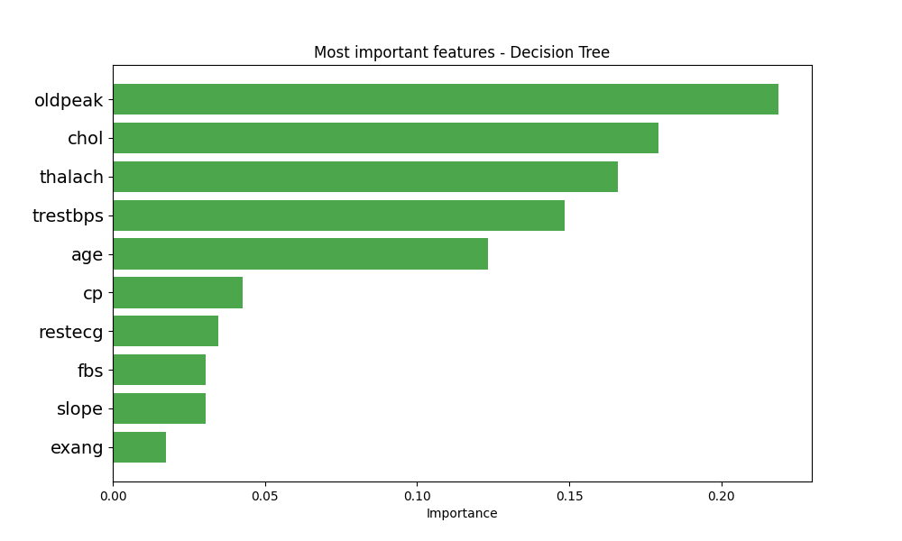
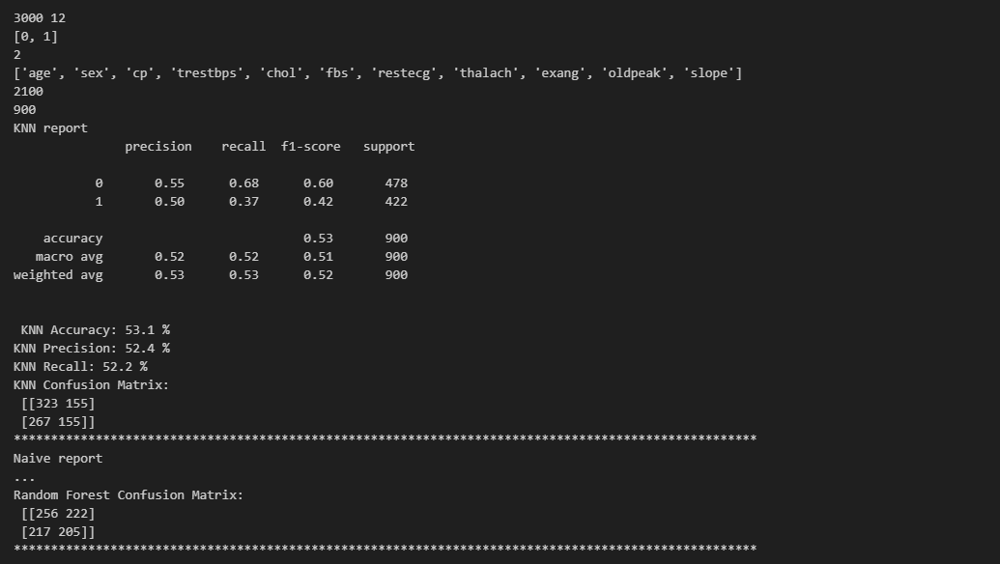

# Heart Failure Prediction using Machine Learning

A comprehensive machine learning project for predicting heart failure using multiple classification algorithms. This project compares the performance of K-Nearest Neighbors (KNN), Naive Bayes, Decision Tree, and Random Forest classifiers.

## 📋 Table of Contents

- [Overview](#overview)
- [Dataset](#dataset)
- [Features](#features)
- [Algorithms Used](#algorithms-used)
- [Installation](#installation)
- [Usage](#usage)
- [Results](#results)
- [Project Structure](#project-structure)

## 🔍 Overview

This project implements and compares four different machine learning classifiers to predict heart failure based on various medical features. The dataset contains patient information including age, blood pressure, cholesterol levels, and other cardiovascular indicators.

## 📊 Dataset

The dataset (`heart_failure.csv`) contains the following features:

- **age**: Age of the patient
- **sex**: Gender of the patient
- **cp**: Chest pain type
- **trestbps**: Resting blood pressure
- **chol**: Serum cholesterol
- **fbs**: Fasting blood sugar
- **restecg**: Resting electrocardiographic results
- **thalach**: Maximum heart rate achieved
- **exang**: Exercise-induced angina
- **oldpeak**: ST depression induced by exercise relative to rest
- **slope**: The slope of the peak exercise ST segment
- **target**: The target variable (presence or absence of heart disease)

## 🎯 Features

- **Data Preprocessing**: 
  - Removes duplicate rows
  - Handles missing values (median imputation for numeric, mode for categorical)
  - Removes outliers using IQR method
  - Feature engineering: Creates age groups, blood pressure categories, cholesterol categories, heart rate zones, and risk levels
- **Feature Encoding**: Converts categorical variables to numerical values
- **Multiple Classifiers**: Implements KNN, Naive Bayes, Decision Tree, and Random Forest
- **Performance Metrics**: Calculates accuracy, precision, recall, and confusion matrices
- **Visualizations**: 
  - Decision tree visualization
  - Feature importance chart

## 🤖 Algorithms Used

1. **K-Nearest Neighbors (KNN)**: K value calculated as √(training set size)
2. **Naive Bayes**: Gaussian Naive Bayes classifier
3. **Decision Tree**: Standard decision tree classifier
4. **Random Forest**: Ensemble method with 100 estimators, max_depth=25

## 📦 Installation

### Prerequisites

```bash
pip install pandas numpy scikit-learn matplotlib graphviz
```

### Additional Requirements

For graphviz visualization, you may need to install Graphviz on your system:
- **Windows**: Download from [Graphviz website](https://graphviz.org/download/)
- **Linux**: `sudo apt-get install graphviz`
- **Mac**: `brew install graphviz`

## 🚀 Usage

### Step 1: Data Preprocessing

First, run the preprocessing script to clean the data and create enhanced features:

```bash
python preprocessing_data.py
```

This script will:
1. Load the original dataset (`heart_failure.csv`)
2. Remove duplicate rows
3. Handle missing values (fill numeric columns with median, categorical with mode)
4. Create additional feature columns:
   - Age Group (40-50, 51-60, 61-70, 71-80, 81-90)
   - Blood Pressure Category (Normal, Elevated, Hypertension Stage 1/2)
   - Cholesterol Category (Desirable, Borderline High, High)
   - Heart Rate Zone (Below Average, Average, Above Average)
   - Risk Level (Low, Moderate, High)
5. Save the enhanced dataset to `heart_failure_enhanced.csv`

### Step 2: Running the Main Script

```bash
python heart_failure.py
```

The script will:
1. Load the preprocessed data (`heart_failure_enhanced.csv`)
2. Remove outliers from specified columns (age, thalach, trestbps)
3. Encode categorical features
4. Split data into training (70%) and testing (30%) sets
5. Train and evaluate all four classifiers
6. Generate performance reports and visualizations

## 📈 Results

### Model Performance Comparison

The script outputs detailed performance metrics for each classifier including:
- Accuracy
- Precision
- Recall
- Confusion Matrix
- Classification Report

### Feature Importance

The Decision Tree model identifies the most important features for prediction:



### Code Execution Results



## 📁 Project Structure

```
heart_failure/
│
├── preprocessing_data.py     # Data cleaning and feature engineering script
├── heart_failure.py          # Main script with all classifiers
├── heart_failure.csv          # Original dataset
├── heart_failure_enhanced.csv # Preprocessed dataset with additional features
├── datasetvariables.txt       # Feature descriptions
├── README.md                  # This file
├── .gitignore                 # Git ignore file
├── Figure_1.png              # Feature importance visualization
├── image.png                 # Code execution results
├── Tree.png                  # Decision tree visualization
└── Tree.svg                  # Decision tree (SVG format)
```

## 🔧 Configuration

You can modify the following parameters in `heart_failure.py`:

- **Test size**: Change `test_size` in `split_data()` function (default: 0.3)
- **Random state**: Modify `random_state` for reproducibility (default: 13)
- **Outlier columns**: Update `columns_to_check` list to change which columns are checked for outliers
- **Random Forest parameters**: Adjust `n_estimators`, `max_depth`, etc. in `apply_random_forest_classifier()`

## 📝 Notes

- **Preprocessing**: Run `preprocessing_data.py` first to clean the data and create enhanced features
- The preprocessing script removes duplicates and handles missing values before feature engineering
- The main script uses median imputation for any remaining missing values
- Outliers are removed using the Interquartile Range (IQR) method
- All categorical features are label-encoded
- The decision tree visualization is saved as `Tree.png`

## 🤝 Contributing

Feel free to fork this project and submit pull requests for any improvements.

## 📄 License

This project is open source and available for educational purposes.

## 👤 Author

Heart Failure Prediction Project

---

**Note**: This project is for educational and research purposes. Always consult medical professionals for actual health-related decisions.
